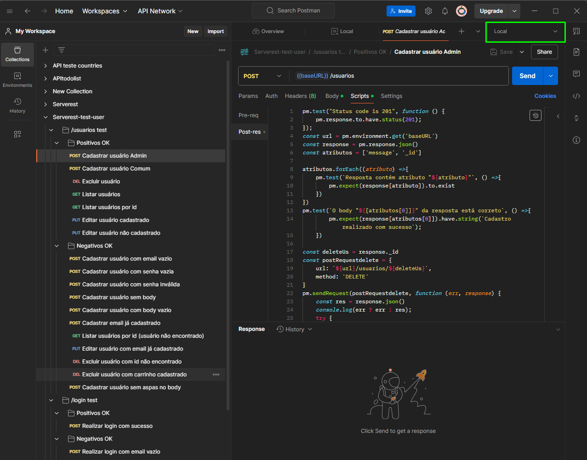

## Preparo para execução do projeto

- Requer o Nodejs 14.0 ou superior instalado, postman e newman instalados na sua maquina.(Na instalação você verá onde baixar e como instalar.)
- Baixar o repositório ou cloná-lo

## Instalação

### Postman
- Para instalação do postman deve-se seguir ao site oficial (https://www.postman.com/downloads/) e baixar a versão correspondente ao seu sistema operacional ou utilizando a versão Web.

### Nodejs
- Para instalação do newman deve-se seguir os seguintes passos:

- Baixar o NodeJS do site oficial ( https://nodejs.org/ ). Apenas certifique-se de instalar a versão que corresponde ao seu sistema operacional.

- Durante a configuração da instalação, confirme se o gerenciador de pacotes npm está selecionado, pois usaremos este pacote na próxima etapa.

- Verificando o sucesso da instalação

- Podemos verificar se o NodeJS e o npm foram instalados com sucesso abrindo cmd e digitando:

- node-v

- A versão do NodeJS deve aparecer.

- npm -v

- A versão Npm deve aparecer.

### Executando os testes
- Para executar os testes é preciso subir sua versão local do Serverest

- Abrindo o terminal execute o comando a seguir:
- npx serverest
- Aguarde a API subir na porta 3000.
- Abra o Postman.
- Importe o arquivo "Serverest-test-sert.postman_collection.json"

- Importe o arquivo de variáveis "Local.postman_environment.json"

- Com os arquivos de teste no seu ambiente, antes de executar qualquer teste é preciso setar o "environment" a ser utilizado, que neste caso é o Local.

- Com tudo configurado, seus testes estão prontos para serem executados.
- Para executar basta ir no teste desejado e clicar na opção "Send"

## Equipe

- Alexandre Monteiro 
- Victor Giovanni
- Heitor Victor